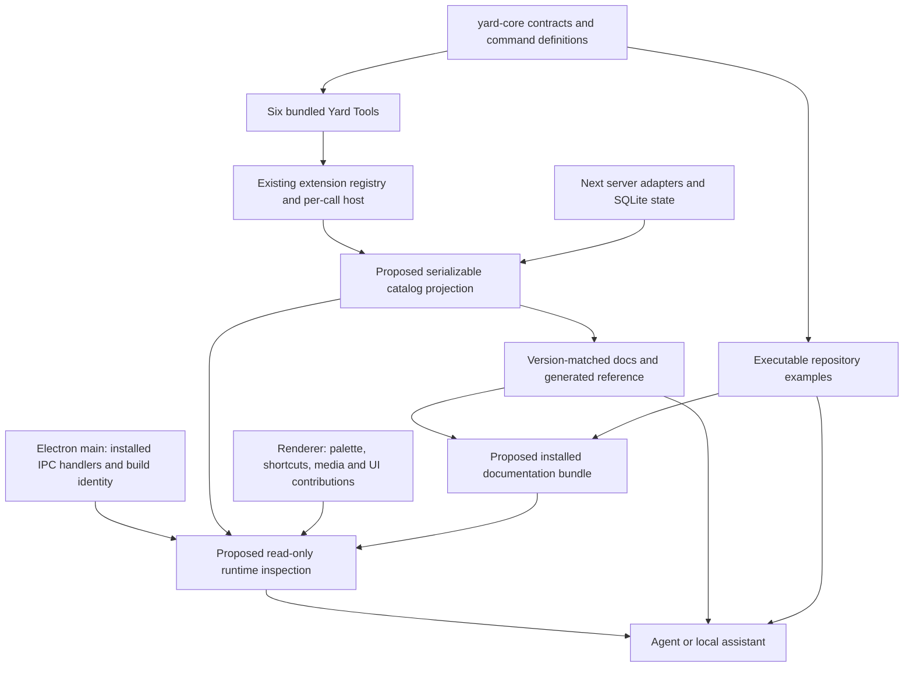

# Foleyard self-awareness and documentation architecture audit

Audit date: 6 September 2026. Scope: the working repository at `f7e7eddd11892504ddd93010fbaec1dbede4a173`, branch `main`, including the pre-existing staged changes. Root package version: `0.1.8`.

This is an audit and proposal. No application changes are authorized by this document. Paths are relative to the repository root unless stated otherwise. Proposed paths are explicitly identified. "Present" means present in this checkout, not verified in a published installer. In particular, the audio streaming, compressed waveform decoding, packaging and query changes were already staged when this audit began. Package version alone cannot distinguish them from another `0.1.8` build.

## 1. Executive summary

Foleyard has more of the necessary architecture than its documentation admits. It has a real host protocol for six bundled workflow extensions, enumerable manifests, per-execution command registries, typed settings, a shared Desktop bridge channel catalog, domain contracts, and integration tests. Its documentation still describes several of those systems as future work.

The main gap is the connection between those facts. There is no versioned runtime description that combines the extension catalog, actual command availability, desktop support, database state and documentation locations. Extension declarations sometimes describe more than the runtime enforces. A surface declaration does not install a menu item, and a permission declaration currently grants itself access in the permission checker. The built-ins execute trusted Node code in the host process. There is no external extension discovery or loading system.

The minimum useful investment is a corrected documentation entry point, an accurate serializable projection of existing registries, and a small runtime identity and document-discovery adapter. Keep the host, repositories, scanner and UI intent model. Third-party package loading is a separate product decision and is not needed to make the current product understandable.

Scores measure the requested target, not overall software quality. Zero means absent; five means authoritative, discoverable, version-matched and exercised.

| Area | Score / 5 | Explanation and inspected evidence |
| --- | ---: | --- |
| Documentation | 2 | Context glossaries, an accurate filesystem ADR and substantial audit records exist. The two architecture guides and tools README contradict current code. There is no docs index or subsystem guide set. See sections 2 and 3. |
| Architecture discoverability | 3 | `CONTEXT-MAP.md`, `packages/yard-core/src/index.ts`, `src/lib/db.ts`, `src/app/library/` and the Electron modules provide recognizable owners. Understanding a tool still requires tracing registry, transport, service and UI adapters. |
| Extension discoverability | 3 | `GET /api/extensions` lists six registered built-ins with enabled state, versions, commands, permissions, settings and surfaces. Command metadata is reduced, and registration is static. `src/lib/extensions/registry.ts` is the authority. |
| Runtime introspection | 2 | Extension catalog, scan status, settings and window state can be queried. Version/build/environment information exists separately. No runtime-info or capability API joins them. |
| Agent self-awareness | 1 | Root `AGENTS.md` routes agents to context documents and ADRs. There is no installed-product docs locator, version matching, read-only runtime summary or runtime agent integration. |
| Example coverage | 1 | `docs/templates/yard-extension/` contains an implementable skeleton, and bundled tools/tests demonstrate behavior. No runnable example entry point, example script or `examples/` directory exists. |
| API documentation | 2 | Core exports and TypeScript contracts describe an intended internal extension API. Transport envelopes, input hydration, UI intents, errors and compatibility policy lack current prose/reference documentation. |

### Evidence and verification scope

Discovery covered first-party files under `src/`, `electron/`, `packages/`, `scripts/`, `docs/`, root configurations, hidden CI configuration, tracked Markdown and relevant ignored local planning documents. Imports and execution were traced through startup, scan/index/search/playback, extension execution, settings, filesystem grants and native actions. Prototype routes and vendored UI primitives were inspected as separate categories, not treated as supported integrations. Historical audit metrics and unrelated visual-design claims were not re-benchmarked or accepted as current facts.

Focused verification on this working tree:

```text
node node_modules/vitest/vitest.mjs run src/test/integration/extension-host-transport.test.ts src/test/integration/desktop-ipc-contract.test.ts src/test/integration/yard-core-services.test.ts
3 test files passed; 12 tests passed; 3 expected failures; 15 total.

node scripts/check-expected-failures.cjs
Failed: 14 it.fails() declarations versus 16 documentation entries.
```

The three expected failures cover Janitor truncation, malformed extension envelopes and host permission enforcement. They are known missing guarantees, not successful implementations of those guarantees. The documentation count still includes B01 and B05, whose tests are no longer marked `it.fails`. This audit did not run the complete application suite, rebuild an installer, inspect the user's database, execute an installed app or establish which code has been released. No live extension enablement values were read. Historical test results are not results from this audit.

## 2. Existing architecture

### Packages and runtime ownership

| Owner | Actual responsibility and wiring |
| --- | --- |
| Root `package.json` | Private Bun workspace, Next/React application and Electron distribution, version `0.1.8`. Workspace patterns are `packages/*` and `packages/yard-tools/*`. Scripts cover web/desktop development, build, release, lint, typecheck, tests and scan benchmarking. |
| `packages/yard-core/` | Private source package `yard-core`, version `0.1.0`, with `main` and `types` pointing to `src/index.ts`. Exports domain records, repository/service interfaces, extension vocabulary/host/registries, filename helpers and concurrency helper. It is an intended contract package, not a published SDK. |
| `packages/yard-tools/` | Six private source packages at version `1.0.0`, depending on `yard-core: workspace:*`. Each exports manifest, registration and service code. Their manifest versions repeat package versions. There are no package export maps, compiled SDK distribution or public publishing scripts. |
| `src/app/page.tsx` and `src/app/library/` | Renderer workspace composition. Imports dedicated hooks for library files, view, selection, organization, bulk actions, extension catalog/UI, transport, palette, shelf and settings/scan. It still explicitly mounts the three tool dialogs. |
| `src/app/api/**/route.ts` | Next server endpoints own request adaptation and call app database/scanner/extension helpers. HTTP is the renderer's main data boundary. |
| `electron/main.cjs` and `electron/main/` | Desktop startup, window lifecycle, native actions, updater, errors, legacy database relocation and production Next bootstrap. Production Next starts in the Electron process through `next-server-adapter.cjs`; desktop development starts Next and Electron separately in `scripts/dev-desktop.cjs`. |
| `electron/preload.cjs`, `src/lib/desktop.ts` | Constrained named Desktop bridge methods and unsubscribe-returning listeners. The renderer cannot enumerate the whole product from this bridge. |

`tsconfig.json` resolves `@yard-core`, `yard-core` and `@foleyard/*` to source files. The package boundaries are useful development contracts, but resolving aliases in the app is not evidence that an independently installed Node consumer can use the same imports.

### Library, indexing, metadata, search and organization

The scan trace is `POST /api/scan` -> `src/lib/scanner.ts` -> `scanner/run-scan.ts` -> lazy `ScanRunner`. The runner receives repository functions from `src/lib/db.ts`, a `RealFileSystemSeam` and `extractMetadata`. It validates roots, discovers audio files, batches index writes, drains metadata work and marks unseen records removed for healthy roots. `scanner/discovery.ts`, `reconcile.ts`, `metadata-queue.ts` and `progress.ts` own these phases. Its optional `onProgress` callback is not supplied by the application composition in `run-scan.ts`. The UI polls `GET /api/scan` through `src/hooks/use-scan-polling.ts`; this is not a public event subscription.

The scanner recognizes the extension list in `packages/yard-core/src/services/library/scan-types.ts`. `src/lib/metadata.ts` reads headers with `music-metadata` and can fall back to a full parse. `scanner/reconcile.ts` requests full parsing for new files or previously missing duration. Existing known files can receive a header-only refresh. Extracted codec, duration, sample rate, bit depth and channel data enter the index. There is no inspected embedded audio-tag writing API or metadata-provider registration. The Settings "Metadata" tab manages collections and tags, not embedded file metadata, as its props and handlers in `src/components/settings/metadata-tab.tsx` show.

`GET /api/files` parses query/pagination/sort options, calls `getFiles`, hydrates tags and returns paging information. `src/lib/database/files/reads.ts` implements filename substring matching, filters and deterministic ordering through Drizzle/SQLite. `src/lib/database/sql-parameters.ts` supplies escaped LIKE patterns and parameter chunking. The collection branch builds different predicates from the ordinary file branch, so do not document all filter combinations as equivalent. The B03 integration regression records this limitation. Search is not a provider architecture, FTS engine or semantic search service.

Collections and tags live in `collection-repository.ts`, `tag-repository.ts`, their HTTP routes, and `src/app/library/use-collections.ts` / `use-tags.ts`. Regular collections store membership rows. Smart collections store JSON criteria and derive membership using a filename query; `src/lib/smart-collection-filter.ts`, `src/app/library/file-query.ts` and `smart-collection-counts.ts` coordinate this behavior. `smart-collections.save-search` is the optional creation workflow; persisted smart-collection behavior is also app/database code. Favorites are file state. Sound Shelf is a separate ordered set of file IDs persisted through its app store, not another collection type.

`src/lib/database/connection.ts` owns the lazy shared SQLite connection, WAL, foreign keys and a busy timeout. `src/lib/db.ts` exports compatibility functions and constructs service/repository adapters over that connection. `src/lib/schema.ts` describes Drizzle tables; `database/migrations.ts` independently creates tables, ensures columns/indexes and backfills roots. There is no numbered migration ledger or application schema version. `onboarding_version` is an onboarding marker, not a database version. `src/lib/database-path.ts` and `electron/main/database.cjs` handle web/desktop and legacy database paths.

### Audio and playback

`AudioPlayer.tsx` composes `use-audio-playback.ts`, which combines volume preferences, waveform retrieval and `use-audio-element.ts`. The last module creates an `HTMLAudioElement` using `/api/audio?id=...`, listens to native media events, seeks with `currentTime`, and tears the element down on file changes. Queue state is in `AudioPlayer/transport-queue.ts`, its hook, and `src/app/library/use-transport.ts`. A playback domain record in core does not supply an extension-accessible playback service.

`src/app/api/audio/route.ts` resolves an indexed file within configured roots and streams it, including byte-range handling. It also records recent files for Make Pack, so this GET is not a wholly side-effect-free automation operation. `GET /api/waveform` calls `waveform-cache.ts`, then `waveform-generator.ts`. The cache checks source identity and persists peak data near the database. The current staged generator handles supported WAV encodings directly and delegates several compressed formats to `waveform-decoder.ts`, which spawns bundled FFmpeg. The renderer shares `client-waveform.ts` for peak requests.

Format claims must distinguish indexing, metadata extraction, waveform generation and actual browser playback. For example `.aif`, `.opus` and `.mp4` occur in decoding/streaming code but are not all in `SUPPORTED_AUDIO_EXTENSIONS`. Successful waveform decoding does not establish HTMLAudioElement codec support. There is no central format-support matrix today.

### HTTP, IPC and filesystem boundaries

The current route inventory has 13 `route.ts` files:

| Route | Methods | Purpose; API standing |
| --- | --- | --- |
| `/api/files` | GET, PATCH, DELETE | Browse and mutate indexed files, favorites/tags, removal/deletion. Internal app API. |
| `/api/directories` | GET | Browse directories from index. Internal. |
| `/api/collections` | GET, POST, PATCH, DELETE | Collection CRUD, filters, membership and conversion. Internal. |
| `/api/tags` | GET, POST, PATCH, DELETE | Tag management. Internal. |
| `/api/settings` | GET, POST | Roots, stats, validation and onboarding state. Internal. |
| `/api/scan` | GET, POST | Poll status and start scanning. Internal. |
| `/api/audio` | GET | Indexed source streaming and recent-use recording. Internal media endpoint. |
| `/api/waveform` | GET | Derived peaks with requested display resolution. Internal. |
| `/api/extensions` | GET, PATCH | Catalog, enablement and setting mutation. Internal introspection precursor. |
| `/api/extensions/execute` | POST | Extension/command envelope -> transport adapter -> host -> outcome. Internal extension transport. |
| `/api/desktop/file` | GET | Resolve indexed file for native operations. Internal desktop helper. |
| `/api/desktop/path` | POST | Resolve paths against roots or granted directories. Internal desktop helper. |
| `/api/desktop/grants` | POST | Register directory grants using desktop process secret. Privileged internal helper. |

`electron/main/ipc-channels.cjs` contains `CHANNEL_SPECS` and derived `CHANNELS`, shared with `ipc.cjs`, preload and `src/lib/desktop-channels.ts`. It records invoke/send/event kind and required payload field names. This is a useful existing registry, not a full payload schema or a list of currently registered handlers. `desktop:simulate-update` is declared and exposed in preload but only registered in main when `!app.isPackaged`.

Native actions travel renderer -> preload -> main -> HTTP indexed-file/path/grant resolution -> native shell/clipboard/drag. `electron/main/desktop-service.cjs` tries Drop Rules preparation before falling back to the indexed file for drag-out. This preserves native drag when the optional extension is disabled or preparation fails.

`src/lib/filesystem-boundary.ts` canonicalizes existing paths, checks root containment and resolves new destination descendants under session grant tokens. `docs/adr/filesystem-access.md` accurately describes the loopback trust model and its non-atomic filesystem limitations. These checks are not applied uniformly to every tool path: Drop Rules apply can receive raw paths through the default transport and use direct filesystem calls. Its E04 test is explicitly expected to fail. Keep that qualification beside any claim about extension filesystem safety.

### Commands, hooks, events, settings and automation

Extension manifests declare 18 commands across the six packages. `YardCommandRegistry` can register, unregister, get, list and execute commands, including handler and validator functions. `YardExtensionHost.execute()` constructs a fresh registry for the requested extension on every execution. It checks extension existence/enabled state, invokes `registerCommands`, validates selection/folder requirements, executes, and converts values/UI intents/errors into an outcome. It does not keep a global active command registry.

The app catalog projects commands down to ID/title. `use-palette.ts` offers commands from enabled extensions without checking manifest `surfaces`, scope or input needs. Built-in navigation, playback and file commands are separately constructed in `components/CommandPalette/command-palette.ts` and dispatched in `use-palette.ts`. Six configurable shortcut actions and their labels/defaults live in `components/Shortcuts/shortcuts.ts`; Ctrl/Cmd+K and other handling also live in the hook. Context menus and player buttons use callbacks. There is no single command-to-shortcut-to-handler mapping across the app.

React hooks are application composition, not extension lifecycle hooks. The concrete event systems are:

| System | Producer / consumer | Current standing |
| --- | --- | --- |
| Desktop bridge events | Main updater/window/errors -> preload listeners -> `UpdateNotifier.tsx`, title bar, About tab | Enumerated by `CHANNEL_SPECS`; desktop-specific internal contracts. |
| `sound-shelf:changed` | `use-shelf.ts`, `FileTable/use-shelf-toggle.ts` -> `src/app/page.tsx` listener | Renderer-local CustomEvent, constant in `extensions/sound-shelf-events.ts`; no payload schema, persistence or cross-process propagation. |
| `desktop-bridge-ready` and listener set | `src/lib/desktop.ts` late-injection detection / `useSyncExternalStore` | Internal renderer compatibility notification. |
| Media events | HTMLAudioElement `timeupdate`, `loadedmetadata`, `play`, `pause`, `ended` -> `use-audio-element.ts` | Native events used to update React state; not forwarded to extensions. |
| Scan progress | `ScanRunner.onProgress`, phase mutation, HTTP polling | Optional callback plus queryable status. No registered domain event bus. |
| Extension progress | Optional `services.scanProgress.report`; Janitor forwards it to service | Host factory accepts a callback, but execute route supplies none. `client-progress.ts` can parse NDJSON, but generic execute returns a final JSON response. |
| Framework/process/UI events | Electron app lifecycle, child process exits, keyboard/resize/media-query/animation listeners | Implementation lifecycle. Do not advertise as stable extension events. |
| UI intents | Host outcome -> `interpretExtensionUiIntent` -> dialogs/settings | Request/result protocol, not a subscription event system. |

There is no current `EventBus` export in core or public event subscription in `YardExtensionContext`. There are no observed emitters for the proposed `library:scan-started`, `metadata:updated` or `extension:loaded` domain catalog.

The seven declared desktop event IDs are `desktop:update-available`, `desktop:update-ready`, `desktop:update-not-available`, `desktop:update-error`, `desktop:update-download-progress`, `desktop:action-error` and `desktop:window-state`. Keep updater/window events desktop-specific. If a real extension needs a stable scan-completed event later, emit it from the scan owner after metadata persistence and reconciliation, with an explicit failed/partial outcome. If organization changes need subscriptions, emit after successful repository mutation rather than optimistic UI changes. Those are proposed promotion rules, not events available today; high-frequency playback time updates should remain renderer-local unless a consumer justifies a separate contract.

Settings have multiple legitimate owners. Library roots, onboarding and extension enabled flags use SQLite settings; extension setting values and Shelf/recent-use state use `extensions/kv-store.ts` and typed adapters. `YardSetting` supplies extension descriptors/defaults/options. Renderer shortcuts, volume, zoom and remove-default preferences use localStorage. `/api/settings` is not a schema endpoint. `/api/extensions` includes extension defaults and current values; coercion does not fully validate select options or numeric bounds.

No product CLI, MCP server, external automation SDK or assistant runtime was found in package scripts, core exports, routes, Electron startup or extension composition. HTTP helpers and maintenance scripts are automation building blocks, not a promised automation product. No filesystem watcher or external library-source provider is wired into scanning.

### Extension and UI coverage

| Concern | Finding |
| --- | --- |
| Discovery/loading | `registerAllExtensions()` imports six packages and registers missing definitions. No directory scan, runtime import, installer or external manifest reader. This is a real bundled extension protocol, not an external plugin loader. |
| Identity and compatibility | Manifests have ID, version, provider and category. Registry validates required strings, namespaced command IDs and duplicate extension/manifest command IDs. No API version/range compatibility check. `Community` is a type option, not proof of loading support. |
| Lifecycle | Registration and enablement gate new executions. No activate/deactivate/dispose hooks, unloaded resource cleanup, cancellation policy or hot-reload protocol. Registry `unregister` is a primitive, not a wired uninstall feature. |
| State | Enabled flags, settings and specific built-in stores exist. No generic extension state service or running/failed activation state. Disabled packages remain imported. |
| Permissions | Checker exposes `has`, `require`, `list`. Host passes the manifest list as granted permissions. Context passes services unchanged; tool services call `require` cooperatively. No independent grants store or centrally enforced service facade. |
| Failure handling | Host catches registration/handler errors and returns typed failure reasons. Catalog-time registration failures occur outside that catch. HTTP decoding/transport failures can also escape. Same-process Node access means no crash/resource/security isolation. |
| Commands/events | Manifest commands and execution registry exist. No extension event provider/subscriber contract. |
| UI intents | `src/lib/extensions/ui-intent.ts` has four built-in handlers and an app-side `registerUiIntentHandler()` mutator. No extension-context hook loads renderer handlers; no unregister/disposal API. |
| Context menus/file actions | Shelf and Make Pack entries in `FileTable/file-row-menu.tsx` are explicit props/JSX. Directory and bulk actions are also explicit. `surfaces` does not generate them. |
| Settings panels | Generic controls consume extension settings in `settings/extensions-tab.tsx`; previews and some workflow UI are bespoke. This is the strongest existing declarative UI integration. |
| Sidebar/toolbar/selection | Built-in app wiring in page, rail and dialogs; declaration labels do not provide arbitrary contributions. |
| Waveform/metadata panels/search/import providers/library sources | No external contribution contract found. Existing components or services are possible future attachment locations, not existing extension points. |

For completeness, the requested extension-system classifications are:

| Category | Status | Scope |
| --- | --- | --- |
| Extension discovery | PARTIAL | Static bundled enumeration; external discovery MISSING |
| Loading | PARTIAL | Build-time imports; external runtime loader MISSING |
| Manifests | EXISTS | Typed bundled objects and registry validation |
| Lifecycle hooks | PARTIAL | Command registration callback; activation/disposal MISSING |
| Permissions | PARTIAL | Declared/cooperative checker, independent grants MISSING |
| Capability access | PARTIAL | Optional context services without central enforcement |
| Public APIs | PARTIAL | Intended private-workspace contracts; external compatibility promise MISSING |
| Version compatibility | MISSING | Version strings exist, no API range enforcement |
| Extension directories | PARTIAL | Source package directory; installed discovery directory MISSING |
| Extension state | PARTIAL | Enablement/settings and bespoke stores; generic lifecycle/state API MISSING |
| Extension commands | EXISTS | Manifest and per-execution registry |
| Extension UI | PARTIAL | Settings, palette projection, app-owned intents and explicit integrations |
| Extension-provided events | MISSING | No host event subscription/emission contract |
| Hot reload | MISSING | Framework development reload is not extension lifecycle support |
| Failure isolation | PARTIAL | Host error outcomes; process/resource isolation MISSING |

## 3. Existing documentation inventory

"Historical" means retain as dated evidence, not maintain as a second live specification. Accuracy below concerns current repository claims and inspected source maps; historical measurements remain unverified measurements of their recorded baseline. The inventory includes all 25 tracked Markdown documents, the ignored redesign plan, the template and meaningful non-Markdown evidence groups. Agent skill installation content under ignored `.agents/` is tooling, not product documentation.

| Document / artifact | Classification and purpose | Accuracy now | Source references, contradictions and problems | Recommended action |
| --- | --- | --- | --- | --- |
| `README.md` | Product/user overview | Partial | Describes local audio browsing correctly but calls collections playlists; conflicts with core glossary. No source map, setup or docs routing. | Retain; rewrite short overview and links using Collection terminology. |
| `RELEASE.md` | Developer/release instructions | Partial, consequential drift | Names real scripts. Says normal `build:desktop` resets DB/opens DevTools; those flags are now on `build:desktop:disposable`. Says workflow runs `release`; actual workflow runs `release:build` then uploads. Installer names now use `Foleyard-Setup-...`. Lock update is conditional on absent `package-lock.json`. | Retain root entry; correct against package scripts, builder config and workflows; link development guide. |
| `AGENTS.md` | Agent routing | Good but narrow | Routes to three existing `docs/agents/` files. No subsystem/runtime/docs version routing. | Preserve rules; append section 11 routing. |
| `CONTEXT-MAP.md` | Architecture/domain map | Mostly good | Links all four real contexts. "Stable core contracts" is an intended dependency rule; direct Node I/O in tools means it is not a capability sandbox. | Retain; link runtime architecture and extension limitations. |
| `src/CONTEXT.md` | Agent/domain vocabulary | Good, brief | Accurate Application/Library workspace terms, no detailed source map. | Retain glossary; link subsystem docs, do not duplicate them. |
| `electron/CONTEXT.md` | Agent/domain vocabulary | Good, brief | Desktop action and bridge match source; omits development desktop mode. | Retain; link desktop guide. |
| `packages/yard-core/CONTEXT.md` | Domain and intended API policy | Mostly good | Names actual adapters/tests; explains removal of old commands in favor of `YardCommandRegistry`. Contradicts older architecture guide's generic command/event claims. "Stable" has no external release/version policy. | Retain authoritative contract intent; clarify internal versus externally supported API. |
| `packages/yard-tools/CONTEXT.md` | Domain vocabulary | Partial | Extension/command terms fit. Permission definition implies protected operations always require it; host service access disproves that guarantee. | Retain; distinguish declared permission from enforced access. |
| `packages/yard-tools/README.md` | Extension developer entry | Stale | Says directory contains no real extensions; registry imports six. No useful current source links. | Replace content with tool catalog and development-doc links. |
| `docs/agents/domain.md` | Agent workflow | Good | Real context map/paths and ADR policy. No context-specific ADR directories currently inventoried. | Keep paths and routing; add links to docs index. |
| `docs/agents/issue-tracker.md` | Agent workflow | Locally consistent | Names repo and `gh` operations, not runtime APIs. Live GitHub policy/state not independently audited. | Keep; no product-doc relocation. |
| `docs/agents/triage-labels.md` | Agent workflow | Internally consistent | Five label roles; live remote label existence not checked. | Keep; link only from agent routing. |
| `docs/adr/README.md` | Architecture decision index | Stale | "No ADRs recorded yet" contradicts neighboring filesystem ADR. | Replace that line with ADR index entry; keep location. |
| `docs/adr/filesystem-access.md` | Architecture/security contract | Mostly accurate | Names real boundary and grant flow, owned staging, permanent deletion and trust limitations. Broad extension-check wording needs explicit Drop Rules apply exception from E04. | Keep authoritative ADR; document implementation gap and link extension guide. |
| `docs/architecture/yard-core.md` | Architecture/developer/API | Stale | References absent `scanner/scan-state.ts` and `AudioPlayer/format-time.ts`; waveform is no longer placeholder; tests and ScanRunner exist. Generic event bus and old service/command claims no longer match exports. | Rewrite in place; preserve ownership explanation and update source map. |
| `docs/architecture/extensions.md` | Extension/API/developer | Partial with major stale claims | Core manifest/registry/context explanation still useful. "No real built-ins" and "no test setup" are false. Missing transport hydration, settings UI, statically bundled model and permission limits. | Rewrite in place as architecture guide; move author-facing contract detail to proposed `docs/extensions.md`. |
| `docs/repo-audit.md` | Historical repository audit | Historical, stale as present tense | Fixed baseline `1ba1cb0`; old route paths and `composition-root.ts`; says docs ignored and CI absent, now false. Overlaps later audits. | Move later to `docs/audits/history/repo-audit-2026-09-04.md`; retain baseline evidence and mark superseded, update incoming links. |
| `docs/modularisation-audit.md` | Historical architecture proposal | Historical | Proposed splits largely exist in `src/app/library/`, settings, scanner, database/files and dotmatrix. Old SettingsDialog path, scan-state and tests references stale. | Archive at proposed `docs/audits/history/modularisation-audit.md`; do not replay migration instructions. |
| `docs/code-reduction-modularisation-audit.md` | Historical architecture/prototype proposal | Historical | Old LOC, 29-route count, composition root and per-tool route epilogues are no longer current. Overlaps prior row but has distinct rationale. | Archive at proposed `docs/audits/history/code-reduction-modularisation-audit.md`; consolidate current conclusions only into live guides. |
| `docs/revisions-progress.md` | Implementation/session notes | Stale | Claims work stays on `revisions`, many implemented splits still Pending; current branch is main. Conflicting historical dotmatrix proposals are recorded here, not live architecture decisions. | Archive at proposed `docs/audits/history/revisions-progress.md`; replace live status with issue links, not another checklist. |
| `docs/audit-2026-09/FINDINGS.md` | Historical audit and acceptance proposals | Mixed | E01/E04 and transport limits still supported by code/tests. S04 "CI omits build" is false now; P04 per-ID hydration changed to batch reads; I01 worker count says eight, runner uses 16; B05 new-file full parse changed. | Keep evidence together in current directory, label historical; link live guides and this audit. Do not overwrite historical observations. |
| `docs/audit-2026-09/IMPLEMENTATION.md` | Historical implementation handoff | Stale operational context | Refers to a prototype branch, untracked docs and preview service from another session. Work-order items are proposals, not authorization. Links findings/prototype code. | Retain alongside findings; add historical banner and current-doc routing. Do not run its preview/cleanup instructions as setup. |
| `docs/test-coverage-baseline.md` | Developer test evidence | Valid historical baseline, not current coverage | Records date/branch and matching coverage thresholds. Test inventory has since changed. | Retain; link from development guide with baseline date. |
| `docs/test-suite-target-shape.md` | Developer test migration plan | Partial/historical | Eight-area/50-test target is a plan; present suite has additional integration files and helpers. References real fixtures and coverage baseline. | Retain with migration-status label; move durable testing guidance into development guide. |
| `docs/expected-failures.md` | Developer live contract ledger | Stale in this working tree | Guard checks count only. It reports 14 declarations versus 16 entries; B01 and B05 are outdated entries. | Reconcile in later change with corresponding passing tests; keep as active ledger, not archive. |
| `redesign-plan.md` | Ignored local UI proposal | Stale/partial | Claims Geist in layout, but inspected layout has no font import; references old Sidebar and Playlist language. Not a product spec. | Leave user-owned file untouched; if retained later, move accepted rationale to historical proposals and clearly label status. |
| `docs/templates/yard-extension/` | Example/template | Partial | Eight files including package JSON; service returns selected IDs. Manifest duplicates settings/permissions instead of importing supplied modules; safeMode is unused; no run entry or registration instructions. | Replace with a runnable selected-IDs example in proposed `examples/extensions/selected-ids/`; keep a redirect/readme only if needed for links. |
| `docs/audit-2026-09/inventory.json`, `test-inventory.json`, `test-results.json` | Generated historical evidence | Historical | Source inventory records baseline; test results refer to deleted unit-test paths. No runtime discovery value. | Preserve as provenance; exclude from installed authoritative docs. |
| `docs/audit-2026-09/query-benchmark.cjs`, `query-benchmark.json` | Executable performance evidence | Historical experiment | Synthetic query experiment, not a supported SDK example or current app latency guarantee. | Keep with audit and reproduction instructions; do not bundle. |
| `docs/audit-2026-09/reproduce.test.ts`, `reproduce.config.ts` | Executable bug evidence | Historical, intentionally separate | Separate config; ordinary Vitest excludes docs. Assertions reproduce faulty behavior rather than specify supported API guarantees. | Keep quarantined; point live contract docs to current integration tests. |
| `src/app/prototype/` | Interactive examples/proposals | Experimental only | `layout.tsx` calls `notFound` in production. Contains UI variants, extension diagrams, repository audit and staged arch-review experiments. Not an SDK examples directory. | Keep out of authoritative feature catalog; retire/archive per design decision. Link only as experimental evidence. |
| `public/cleanup.html` | Staged interactive implementation inventory | Local proposal | Static HTML is outside the prototype layout guard. No build/version provenance in the inspected entry. | Label experimental and review packaging/routing separately; do not present as runtime truth. |
| Source comments/JSDoc and `src/test/integration/` | Internal API documentation and working contracts | Mixed, strongest when behavioral | Registry contracts, IPC channel comments, filesystem checks and tests explain actual behavior. Test-only exports and expected failures are not stable public APIs. | Retain near owners; link relevant tests from subsystem docs, avoid copying whole implementations. |

No root changelog, docs index, user quickstart, standalone SDK guide, external extension manifest guide or executable `examples/` tree was found. Absence findings come from tracked/hidden file inventory plus source/import searches, not just the candidate document tree.

## 4. Gap analysis

EXISTS means an executable equivalent is present. PARTIAL means some required information is exposed. IMPLICIT means implementation makes the fact knowable but offers no intentional inspection contract. MISSING means no equivalent was found.

| Area | Target | Current Foleyard | Gap | Priority |
| --- | --- | --- | --- | --- |
| Runtime identity | One machine-readable identity | PARTIAL: About imports package version; main knows platform/packaged state and reads Next BUILD_ID for reset logic | No combined API, commit identity or renderer/server version match | P1 |
| Database identity | Applied application schema version | IMPLICIT: table/column probes and initialization only | Need explicit unversioned reporting, then baseline/versioned migrations | P2 |
| Enabled features | Report what this session supports | PARTIAL: extension enablement and desktop detection | No aggregate availability; declarations can exist without handlers | P1 |
| Capability registry | Identified operations with availability | IMPLICIT: permissions, service implementations, routes, playback and IPC | No machine-readable implemented capability catalog | P1 |
| Commands | Enumerated metadata, prerequisites and execution owner | PARTIAL: extension manifests/registry; separate palette and shortcuts | Serialization loses metadata; duplicated manifest/registration definitions; no unified app catalog | P1 |
| Events | Documented public catalog | PARTIAL internally; MISSING public domain subscriptions | IPC table exists; callbacks and DOM events are unrelated contracts | P2 |
| Extensions | Discoverable actual extension state | PARTIAL: six registered built-ins and enablement | Cannot truthfully report active lifecycle, compatible third-party packages or external loading | P1 for built-in truth; P3 for external loading |
| UI extension points | Discoverable implemented contribution contracts | PARTIAL: generic settings and palette projection, app intent map | `YardSurface` labels overstate generic integration support | P2 |
| Settings schema | Schemas with owner/scope | PARTIAL: extension `YardSetting[]`; app values elsewhere | No app preference schema and incomplete validation | P2 |
| Docs | Authoritative version-matched set | PARTIAL in repository; MISSING installed discovery | Stale core docs, no index or build-bound bundle | P1 |
| Examples | Working versioned integrations | PARTIAL: skeleton and tests | No executable entry point or documented invocation | P1 for one example; P2 for broader coverage |
| Agent awareness | Find docs and actual runtime facts | PARTIAL repository routing; MISSING runtime access | Needs docs index, provenance and read-only inspector | P1 |
| API standing | Explicit internal/experimental/public status | PARTIAL intended core contract policy | No API version/compatibility policy; routes can be mistaken for public SDK | P0 |
| Permission semantics | Truthful supported guarantees | PARTIAL cooperative checks | Must label present trust model before publishing claims; enforce centrally before presenting effective grants | P0 for contract truth; P1 enforcement; external isolation conditional |

P0 here means a prerequisite to publishing an authoritative contract. It does not mean every subsystem needs a rewrite before documentation can improve. P1 is important, P2 useful and P3 optional.

### Runtime identity detail

| Question | Classification | Exact current source / limitation |
| --- | --- | --- |
| Application version | EXISTS locally, PARTIAL discovery | `components/settings/about-tab.tsx` exports `APP_VERSION` from root package JSON; no getVersion bridge method. |
| Platform | IMPLICIT | `process.platform` drives main lifecycle and scripts. No renderer platform DTO. |
| Build information | PARTIAL | `getPackagedBuildId` reads `.next/BUILD_ID` privately in `electron/main/database.cjs`; flags are package extraMetadata. No commit/dirty provenance endpoint. |
| Development/production | EXISTS internally | `NODE_ENV`, `FOLEYARD_DESKTOP`, `app.isPackaged` and desktop bridge detection describe different facts; do not merge them into one boolean. |
| Database version | MISSING as product version | Initialization probes schema; no ledger or `user_version` management. Do not relabel SQLite's internal schema cookie as application migration version. |
| Enabled features | PARTIAL | `getExtensionEnabled` returns true only for stored `"true"`; missing flags default false. UI receives catalog state. No active-session capabilities snapshot. |
| Docs/examples paths | MISSING | No locator, reader, IPC method or bundle manifest in inspected startup, bridge, routes or exports. |

## 5. What Foleyard already does well

The extension registry and host are the right starting point. They already distinguish definitions, commands, input validation, UI intents and execution failures. `listManifests()` and the existing GET catalog avoid any need to invent a separate hand-maintained extension list.

The Desktop bridge has one channel inventory and a contract test. Use its channel definitions and actual handler installation to derive desktop facts. Do not introduce another independent list of IPC names.

The domain layout preserves useful boundaries. `yard-core` has no React/Next/Electron window dependency; the application supplies SQLite and filesystem adapters. Scanner and repository contracts have behavioral tests. The shared connection, batching, waveform cache and grant implementation solve real problems and should remain.

Context documents and the filesystem ADR are concise. Keep terminology close to owners, detailed subsystem documentation in docs, and agent routing short. Historical audits contain useful evidence when clearly dated. Their problem is authority and status, not their existence.

## 6. Missing pieces

### Required for the stated self-awareness target

- One docs entry point and corrected current architecture/extension guides, with explicit current/internal/experimental/proposed standing.
- A serializable catalog derived from the existing extension definitions, command definitions and installed desktop handlers, without executing commands to discover them.
- Runtime and documentation provenance that can distinguish two builds sharing the same package version.
- A read-only runtime inspection boundary and document-by-ID discovery/reading contract.
- At least one executable contract example tied to the same source revision.
- Honest capability and permission descriptions. Do not claim installed community extension support or enforced grants until those mechanisms exist.

### Recommended

- Shared command metadata consumed by both manifests and handler registration; a small app command descriptor table used by the palette/shortcuts.
- Host-owned service permission checks and complete transport validation before broadening command automation.
- An applied schema baseline/version, settings descriptor projections and a small internal event catalog.
- Minimal CI checks for links, catalog references, examples and packaged documentation identity.
- A selected-file context-menu contribution adapter once the first example requires it.

### Optional or conditional

- External extension directories, install/uninstall, compatibility ranges, isolated execution, hot reload and community permissions UI. These belong together only if external executable extensions become a product goal.
- Public domain subscriptions, search providers, metadata providers, library-source providers, waveform panels and arbitrary renderer UI. There is no current need to invent all of them.
- A standalone SDK, MCP/CLI integration or documentation search index. A docs reader and exported runtime summary are enough initially.

## 7. Proposed architecture

Keep process-specific adapters. The introspection layer aggregates descriptions; it does not become a second command executor or own the application state.



Renderer information is an explicitly scoped optional portion of a snapshot. A server-only query must report renderer availability as unknown, not infer selection, current shortcuts or audio state from server code. Static catalogs are build artifacts; enabled/available facts are runtime reads.

Use an app-owned definition adapter to associate existing tool definitions with transport and UI contribution descriptors. Keep server functions and renderer handlers in separate entry points. Reuse `transportAdapters` and `uiIntentHandlers`; replacing their hard-coded initialization with descriptors can happen one tool at a time. Do not import Node-backed tool services into the browser just to show a command title.

## 8. Proposed file changes

This table is a proposal, not a patch list already applied. "Add" identifies a new path. S/M/L complexity is relative implementation effort. Dependencies refer to earlier rows' IDs. Every behavior change must retain the existing execution boundary and be tested when implemented.

| ID | Path | Action | Reason / concrete change | Priority | Public API impact | Risk / complexity | Dependencies |
| --- | --- | --- | --- | --- | --- | --- | --- |
| D1 | `docs/index.md` | Add, proposed | Route readers to current docs, contracts and dated audits; stop stale plans acting as setup | P1 | None | Low / S | Status vocabulary agreed |
| D2 | `README.md`, `RELEASE.md`, `docs/architecture/yard-core.md`, `docs/architecture/extensions.md`, `packages/yard-tools/README.md`, `docs/adr/README.md` | Modify | Correct contradictions in inventory; keep existing useful locations | P1 | Clarifies standing, no runtime change | Low / M | D1 |
| D3 | `AGENTS.md`, `docs/agents/domain.md`, four existing `CONTEXT.md` files | Modify | Add routing, retain glossary and workflow policy | P1 | None | Low / S | D1, D2 |
| D4 | `docs/expected-failures.md` | Modify later | Reconcile obsolete B01/B05 ledger entries with passing contract regressions | P1 | None | Low / S | Verify corresponding tests before editing |
| D5 | `docs/audits/history/` | Add proposed archive directory; move four named audit/progress files from section 3 | Separate historical proposals from current contracts; update incoming links | P2 | None | Link drift / S | D1 |
| C1 | `packages/yard-core/src/extensions/vocabulary.ts`, `extension-command-registry.ts`, `extension-host.ts` | Modify | Agree API standing; add serializable descriptions/status and reuse command definitions in registration. Keep per-call handlers. | P0 policy, P1 code | Additive internal contract; explicit future API version | Moderate / M | Contract policy |
| C2 | `packages/yard-tools/*/src/commands.ts`, `manifest.ts`, `package.json` | Modify six existing packages | Share definitions between manifests/handlers; derive version from package metadata; retain current IDs | P1 | No intended command ID change | Moderate / M | C1 |
| C3 | `src/lib/extensions/catalog.ts` | Add, proposed | Project full safe metadata without handler/validator functions or settings values | P1 | New internal DTO | Low / S | C1; can first project existing manifests |
| C4 | `src/lib/extensions/registry.ts`, `src/lib/extensions/types.ts`, `src/app/api/extensions/route.ts` | Modify | Use catalog projection while preserving existing UI response compatibility | P1 | Additive internal HTTP fields | Low / M | C3 |
| C5 | `src/lib/commands.ts`, `src/app/library/use-palette.ts`, `src/components/CommandPalette/command-palette.ts`, `src/components/Shortcuts/shortcuts.ts` | Add first path, modify existing others | App command descriptors map current palette IDs, aliases and shortcut actions; UI dispatch consumes same mapping | P1 | Internal, no shortcut reset or silent ID renaming | Moderate / M | C1 |
| C6 | `src/lib/capabilities.ts`, `src/lib/extensions/host.ts`, `src/lib/db.ts` | Add first path, modify adapters | Describe operations at composition and derive available services; separate permission requirements from availability | P1 | Internal capability IDs initially | Moderate / M | C1, C3 |
| C7 | `packages/yard-core/src/extensions/extension-context.ts`, `extension-host.ts`, `src/lib/extensions/host.ts`, `src/app/api/extensions/execute/route.ts`, `transport.ts` | Modify | Wrap protected services, validate envelopes, distinguish requested/effective grants; close known transport bypass before broad automation | P1 | Tightens internal access; future external prerequisite | Moderate to high / L | C6, existing filesystem ADR; separate bounded fixes |
| R1 | `src/lib/runtime-info.ts`, `src/app/api/runtime/route.ts` | Add, proposed | Aggregate read-only server facts with unknown/degraded sections, no generic execute endpoint | P1 | New internal inspect DTO, versioned before external support | Low to moderate / M | C3, C6, docs identity |
| R2 | `electron/main/runtime-info.cjs`, `electron/main/ipc.cjs`, `ipc-channels.cjs`, `electron/preload.cjs`, `src/lib/desktop.ts` | Add first path, modify existing others | Main owns identity and actual channel installation; bridge exposes inspection and optional export | P1 | Additive Desktop bridge methods | Moderate / M | R1, package/build identity |
| R3 | `src/lib/database/migrations.ts`, `connection.ts` | Modify | Report unversioned now; later baseline existing schema and record applied migration version transactionally | P2 | New diagnostic fact; persisted schema policy | Moderate / M | Separate migration design; no schema rewrite |
| E1 | `src/lib/events.ts`, `src/lib/extensions/sound-shelf-events.ts`, `src/lib/scanner/run-scan.ts`, `electron/main/ipc-channels.cjs` | Add first path, modify adapters only as needed | Catalog current internal contracts; wire any promoted domain event at real completion points | P2 | Internal first; subscriptions require explicit later contract | Moderate / M | C1, R1; real consumer before new events |
| U1 | `src/lib/extensions/ui-contributions.ts`, `src/lib/extensions/ui-intent.ts`, `src/components/FileTable/file-row-menu.tsx`, `src/app/library/use-palette.ts` | Add first path, modify existing others | Enumerate implemented contributions; one context-menu action adapter, reuse intent map | P2 | Internal contribution contract | Moderate / M | C2, C5 |
| S1 | `src/lib/settings-schema.ts`, `src/components/Shortcuts/shortcuts.ts`, `src/hooks/use-zoom.ts`, `src/components/AudioPlayer/use-volume-preferences.ts`, `src/app/api/extensions/route.ts` | Add first path; adapt existing consumers | Reuse defaults and validators; identify SQLite versus renderer preferences; validate options | P2 | Additive schema view; validation tightening | Moderate / M | C3, scope policy |
| P1 | `src/lib/documentation.ts`, `scripts/prepare-docs.cjs`, `scripts/check-docs.cjs` | Add, proposed | Allowlisted document IDs, manifest/provenance, selected bundle and lightweight link/reference checks | P1 | Read-only discovery contract | Moderate / M | D1, C3, R1 |
| P2 | `electron-builder.yml`, `package.json`, `.github/workflows/check.yml`, `.github/workflows/release.yml` | Modify | Prepare docs after build identity exists, bundle with extraResources and verify before release upload | P1 | Installed docs become supported resources | Moderate / M | P1, R2 |
| X1 | `examples/extensions/selected-ids/README.md`, `index.ts`, `run.ts` | Add, proposed; supersede old template | Small host-run command example with selection and explicit failure case | P1 | Demonstrates existing internal contract | Low / S | C1, documented repo runner |
| X2 | `examples/core/query-library/README.md`, `run.ts` | Add, proposed | Disposable in-memory SQLite query example using repo adapters; explicitly app-internal | P2 | No standalone SDK promise | Low / S | Database/search docs |
| X3 | `src/test/integration/runtime-introspection.test.ts`, `documentation-bundle.test.ts`; existing host/IPC tests | Add proposed two files; extend existing suites | Verify projection, missing providers, no secret leakage and packaged resource identity | P1 | Pins intended contract | Low / M | R1, R2, P1 |

New documentation paths in section 9 are also proposed additions, except paths explicitly inventoried in section 3. Do not create all of them as empty stubs. Stage 1 creates the entry point and corrected guides; subsequent stages add each substantive subsystem guide with its source owner.

## 9. Proposed `/docs` tree

Preserve the existing `architecture/`, `agents/`, `adr/` and dated evidence locations. Combine related small subjects instead of creating separate SDK, permissions, event transport, extension packaging and API files before those products exist.

```text
docs/
├── index.md                         # new
├── quickstart.md                    # new: user workflow and source setup links
├── development.md                   # new: setup, tests, release routing
├── library.md                       # new: index, browsing, root ownership
├── scanning.md                      # new: lifecycle, polling, failure semantics
├── metadata.md                      # new: extracted versus user metadata
├── playback.md                      # new: queue, audio, waveform and format matrix
├── search.md                        # new: query semantics and limits
├── collections.md                   # new: collections, tags, favorites, shelf links
├── filesystem.md                    # new: grants, operations, known exceptions
├── settings.md                      # new: schemas and persistence owners
├── database.md                      # new: schema, connection and migrations
├── extensions.md                    # new: bundled extension author contract/examples
├── commands.md                      # new: execution model and generated catalog
├── events.md                        # new: existing internal event contracts
├── runtime.md                       # new: introspection, docs lookup and agent use
├── architecture/
│   ├── application.md               # new: runtime composition and HTTP boundary
│   ├── desktop.md                   # new: startup, IPC, packaging, updater
│   ├── yard-core.md                 # rewrite existing
│   └── extensions.md                # rewrite existing host/adapters architecture
├── agents/
│   ├── domain.md
│   ├── issue-tracker.md
│   └── triage-labels.md
├── adr/
│   ├── README.md                    # fix index
│   └── filesystem-access.md
├── audits/
│   ├── foleyard-self-awareness-audit.md
│   └── history/                     # proposed moves, preserve original baselines
│       ├── repo-audit-2026-09-04.md
│       ├── modularisation-audit.md
│       ├── code-reduction-modularisation-audit.md
│       └── revisions-progress.md
├── audit-2026-09/                   # retain historical evidence together
│   ├── FINDINGS.md
│   ├── IMPLEMENTATION.md
│   ├── inventory.json
│   ├── test-inventory.json
│   ├── test-results.json
│   ├── query-benchmark.cjs
│   ├── query-benchmark.json
│   ├── reproduce.config.ts
│   └── reproduce.test.ts
├── expected-failures.md             # live ledger
├── test-coverage-baseline.md         # dated evidence
└── test-suite-target-shape.md        # historical migration plan
```

`docs/templates/yard-extension/` moves to the executable example after its replacement works. Root README, RELEASE, AGENTS, CONTEXT-MAP and local context docs stay at their current paths. The ignored redesign plan stays untouched. Build-generated reference JSON/Markdown belongs in the staged documentation bundle, not a separately hand-edited source tree. There is no need for an empty `sdk.md`, `automation.md`, `extension-manifest.md`, `packaging-extensions.md` or provider guide.

The following table defines every new or rewritten live guide. Existing retained workflow, ADR and historical documents retain the audiences/purposes in section 3.

| Guide | Purpose and audience | Authoritative source | Related links | Existing material |
| --- | --- | --- | --- | --- |
| `index.md` | Readers/agents choose current subsystem and determine document status | Build docs manifest; routing policy | All live guides, CONTEXT-MAP, separately labeled audits | None |
| `quickstart.md` | User adds a root, scans, searches, previews and organizes; developer setup routes out | `OnboardingDialog.tsx`, `use-settings-scan.ts`, page/library hooks | Library, scanning, playback, collections, development | README and UI copy |
| `development.md` | Contributors install, run, verify and understand fixture isolation | Package scripts, dev/rebuild scripts, CI, Vitest, fixtures | RELEASE, architecture/application, test ledger and baseline | RELEASE and test documents |
| `library.md` | Contributors/advanced users understand roots, file identity, browsing and removal | `domain/audio-file.ts`, database files/browse repositories, `use-library-files.ts` | Scanning, search, collections, filesystem, database | Core context; historical audits |
| `scanning.md` | Contributors understand discovery, metadata queue, progress and partial failure | `scanner/run-scan.ts`, runner, phases, scan route and polling hook | Library, metadata, database, events | Old core architecture paragraphs |
| `metadata.md` | Contributors/users distinguish extracted fields, tags and absent embedded-tag editing | `metadata.ts`, scanner reconciliation, schema, settings metadata tab | Scanning, playback format matrix, collections | No current standalone guide |
| `playback.md` | Contributors/users understand preview, queue, waveform and stage-specific format support | AudioPlayer modules, audio/waveform routes, waveform files, scan extension list | Library, metadata, commands, desktop architecture | Stale architecture paragraphs |
| `search.md` | Contributors/agents understand actual query fields, sorting, pagination and limitations | File route, database reads/sql-parameters, `file-query.ts`, core search types | Library, collections, database | Audit findings only |
| `collections.md` | Contributors/users understand membership, saved query, favorites, tags and Shelf distinction | Organization repositories/routes/hooks; smart-collections and sound-shelf packages | Search, library, extensions, database | Core glossary |
| `filesystem.md` | Contributors/tool authors understand allowed reads/writes, grants and destructive outcomes | Boundary module, desktop helpers, delete worker, tool services | Filesystem ADR, extensions, desktop architecture | Filesystem ADR plus known failure tests |
| `settings.md` | Contributors/tool authors find descriptors, storage owner, defaults and validation | Settings repository, extension vocabulary/stores/route; shortcuts/volume/zoom | Extensions, runtime, database | Manifest types and controls |
| `database.md` | Contributors understand tables, connection, migrations and legacy paths | Schema, migrations, connection, database-path; Electron database helper | Library, scanning, development, filesystem | Core architecture source list |
| `extensions.md` | Built-in authors understand manifest, commands, permissions, settings, UI intents and version standing | Core extensions exports, six packages, host transport | Architecture/extensions, commands, settings, filesystem, examples | Existing architecture/extensions and template |
| `commands.md` | Contributors/agents find IDs, input/output contract, owner, availability and error behavior | Shared tool definitions, registry/host, app palette/shortcut mapping | Extensions, runtime, playback, settings | Types and tests only |
| `events.md` | Contributors distinguish existing internal channels/callbacks from any future public events | IPC specs, shelf constant, scan callback, audio-element listeners | Commands, runtime, scanning, desktop architecture | Stale event-bus references to replace |
| `runtime.md` | Agents/contributors inspect identity, capability standing, doc IDs and absent providers | Proposed runtime-info/documentation adapters and current catalogs | Index, commands, events, extensions, settings, architecture/desktop | None |
| `architecture/application.md` | Contributors trace renderer/HTTP/server state ownership | Page/library hooks, API routes, db composition, layout | Core, desktop, extension architecture and subsystem guides | Context map and audit traces |
| `architecture/desktop.md` | Contributors trace main/preload, real IPC availability, startup and installed docs | Main/bootstrap/window/preload, IPC specs, builder config | RELEASE, filesystem ADR, runtime, application architecture | Electron context and release guide |
| `architecture/yard-core.md` | Contributors distinguish intended exported contracts from adapters | Core barrel/domain/repositories/services/extensions; `src/lib/db.ts` | CONTEXT-MAP, database, scanning, extensions | Existing guide, needs rewrite |
| `architecture/extensions.md` | Contributors trace registration -> transport -> host -> service -> UI | Registry/runtime/host, execute transport, intent map, dialogs | Author guide, filesystem, runtime, commands | Existing guide, needs rewrite |

## 10. Documentation template

Use two independent status axes. A shipped feature can have an internal API; a proposed feature cannot be called stable merely because the idea is accepted. Source revision and package version belong in a generated documentation manifest. Do not manually bump version headers on every page.

````md
# <Subsystem>

> Feature status: shipped | experimental | proposed
> Contract: internal | public-experimental | public-stable | none
> Owner: <existing module/package/process>
> Applies to: <documentation manifest ID; development checkout when unbuilt>
> API version: <only when an intentional versioned API exists>

## What it does

Explain the user or developer behavior in a short paragraph.

## Responsibilities and boundaries

State what this owner controls and where the next owner takes over.
Distinguish renderer, Next server, Electron main and persisted state.

## Runtime behavior

Describe entry point, lifecycle, availability and completion semantics.
Describe web/desktop differences where they exist.

## Contracts

List intentionally supported interfaces and their standing.
Link generated reference for IDs/types instead of copying a catalog.
For an internal-only subsystem, say so and identify its intended callers.

## Failure behavior and limitations

State partial results, known missing guarantees, recovery and relevant
expected-failure regressions. Do not claim stronger behavior than tests/code.

## Source map

- `<owner entry point>`: composition and lifecycle
- `<contract module>`: types/definitions
- `<behavioral test>`: executable contract and known limitations

## Examples

Link the smallest runnable example, exact repository command, prerequisites,
expected output and any temporary files it creates. Omit when none exists.

## Related documentation

- `<related guide>`
- `<relevant ADR>`
````

Add `Data and persistence`, `Events`, `Extension contributions`, `Permissions and trust`, or `Version compatibility` only when relevant. For a proposed design, state the unmet prerequisites and do not provide a command that appears to invoke a nonexistent API. Generated references must separate declared IDs from registered/available runtime entries.

## 11. AGENTS.md documentation routing

Append the following section after the existing rules once the linked guides exist. Do not paste it into AGENTS.md during this audit or introduce broken routing links before those documents are written.

```md
## Documentation and runtime facts

Start with `docs/index.md` for current documentation and `CONTEXT-MAP.md`
for domain owners. Follow the existing context/ADR rules in
`docs/agents/domain.md` before changing a subsystem.

Read the relevant guide and follow its source map:

- Library/indexing: `docs/library.md` and `docs/scanning.md`.
- Search and saved criteria: `docs/search.md` and `docs/collections.md`.
- Metadata: `docs/metadata.md`; playback/waveforms: `docs/playback.md`.
- Database and migrations: `docs/database.md`.
- Filesystem operations: `docs/filesystem.md` and
  `docs/adr/filesystem-access.md`.
- Electron/IPC: `docs/architecture/desktop.md`.
- Application/HTTP boundaries: `docs/architecture/application.md`.
- Core contracts: `docs/architecture/yard-core.md`.
- Bundled extensions: `docs/extensions.md` and
  `docs/architecture/extensions.md`.
- Commands/events/settings: `docs/commands.md`, `docs/events.md`,
  and `docs/settings.md`.
- Runtime identity, capability availability and installed docs:
  `docs/runtime.md`.
- Setup, tests and release: `docs/development.md` and `RELEASE.md`.

Runnable examples live in `examples/`; their READMEs state prerequisites
and commands. Prototype routes and dated audit handoffs describe experiments
or historical findings, not the installed product's supported behavior.

For questions about a running installation, inspect runtime information and
the matching documentation manifest as described in `docs/runtime.md`.
Do not infer installed capabilities from this checkout's package version,
manifest declarations or proposed documents. Report unavailable runtime
information as unknown. Source code wins when documentation disagrees;
record the contradiction before relying on that document.
```

## 12. Runtime introspection design

### Ownership and read model

`src/lib/runtime-info.ts` should assemble server information. It reads existing registries and composition adapters; it does not instantiate commands with fabricated selections or run handlers. Electron main owns platform, application version, packaged state, installed channel availability and resource paths. The renderer owns current selection, actual shortcut overrides, media state and mounted contribution availability. Database initialization owns its applied migration state.

Use one versioned inspection DTO with optional provider sections. Missing renderer/desktop information must be explicit. A web-only app can still return useful server/core/extension data. A failing database must not prevent identity and docs retrieval; do not open/migrate the database just to answer "what version is this?" Read database details only from an already initialized owner or return `not-initialized`.

The following describes the minimum shape, not implementation code or an already exported API:

```ts
type FeatureStatus = "shipped" | "experimental";
type ContractStatus = "internal" | "public-experimental" | "public-stable";
type Availability = {
  state: "available" | "unavailable" | "unknown";
  reason?: string;
};

interface RuntimeIdentity {
  product: "Foleyard";
  version: string;
  buildId?: string;
  sourceRevision?: string;
  sourceDirty?: boolean;
  environment: "development" | "production";
  mode: "web" | "desktop";
  packaged?: boolean;
  platform?: string;
}

interface CapabilityDescription {
  id: string;
  owner: "server" | "renderer" | "desktop";
  featureStatus: FeatureStatus;
  contract: ContractStatus;
  availability: Availability;
  requiredPermissions: string[];
  docsId: string;
}

interface CommandDescription {
  id: string;
  extensionId?: string;
  title: string;
  description: string;
  scope: string; // Preserve YardCommandScope for extension commands.
  executionOwner: "extension-host" | "renderer" | "desktop";
  destructive: boolean;
  requiresSelection: boolean;
  requiredCapabilities: string[];
  defaultShortcut?: string;
  currentShortcut?: string; // Only with a renderer session observation.
  availability: Availability;
  input: { kind: "none" | "documented" | "schema"; ref?: string };
  resultRef?: string;
  docsId: string;
}

interface ExtensionDescription {
  id: string;
  version: string;
  source: "bundled";
  registered: boolean;
  enabled: boolean;
  executionModel: "per-command";
  contract: ContractStatus;
  apiVersion?: string;
  requestedPermissions: string[];
  permissionModel: "trusted-declarations" | "host-enforced";
  effectivePermissions?: string[];
  commandIds: string[];
  declaredSurfaces: string[];
  implementedContributionIds: string[];
  docsId: string;
}

interface EventDescription {
  id: string;
  owner: "server" | "renderer" | "desktop";
  transport: "ipc" | "renderer-local" | "callback";
  contract: ContractStatus;
  payloadRef?: string;
  subscriptionAvailable: boolean;
}

interface ExtensionPointDescription {
  id: string;
  owner: "renderer" | "server";
  contributionKind: "command" | "setting" | "ui-intent";
  contract: ContractStatus;
  availability: Availability;
  docsId: string;
}

interface DocumentationLocation {
  manifestId: string;
  productVersion: string;
  buildId?: string;
  sourceRevision?: string;
  matched: boolean;
  indexId: string;
  documentIds: string[];
  examples: Array<{ id: string; sourceRevision?: string; runnableIn: "repository" }>;
  localRoot?: string; // Only for an explicitly local consumer.
}

interface FoleyardRuntimeInfo {
  schemaVersion: 1; // Inspection DTO version, not DB or extension API version.
  observedAt: string;
  identity: RuntimeIdentity;
  providers: Array<{
    owner: "server" | "renderer" | "desktop";
    status: "present" | "absent" | "failed";
    observedAt?: string;
  }>;
  database: {
    state: "ready" | "not-initialized" | "unavailable";
    migration: "unversioned" | "versioned";
    appliedVersion?: number;
  };
  capabilities: CapabilityDescription[];
  commands: CommandDescription[];
  extensions: ExtensionDescription[];
  events: EventDescription[];
  extensionPoints: ExtensionPointDescription[];
  settingsSchemaRefs: string[];
  documentation?: DocumentationLocation;
}
```

Proposals live in documentation and are excluded from runtime `capabilities`. A shipped internal feature and a public API are separate facts. `registered` and `enabled` replace an inaccurate `loaded/active` lifecycle label for the current host. Availability is advisory and time-bound; execution must recheck enablement, selection, permissions and path grants. Renderer-derived data is scoped to one session, not a global server fact. Large catalogs may be linked documents rather than repeated in every snapshot.

### Derivation and duplication rules

| Information | Source of truth | Derivation / minimum new metadata |
| --- | --- | --- |
| App/core/tool versions | Respective package metadata | Generate build manifest; remove repeated tool version strings as packages migrate. |
| Build identity | Next BUILD_ID plus captured source revision/dirty flag | Generate once during build; do not confuse Next ID with Git revision. |
| Extension identities and requested permissions | Existing registered manifests | Project with `listManifests`, use live enabled flags; no new inventory file. |
| Command metadata | Shared command objects reused by manifest and registration | Strip functions. Check registered IDs match declarations without executing handlers. |
| Command input | Existing validators and documented transport boundary | Validators are arbitrary functions and cannot be reliably converted to JSON Schema. Initially publish a documented input reference; adopt serializable validation schema only when the same schema will validate requests. |
| Capabilities | Service/handler registrations at app composition | Small semantic IDs and descriptions are unavoidable new policy metadata. Put them beside the operations they describe and derive availability from actual registration. Do not infer `metadata.write` from a broad `files:write` permission. |
| Desktop support | Handler registration and `CHANNEL_SPECS` | Separate static declared channels from installed handlers; exclude simulator in packaged availability. |
| Settings | Manifest `YardSetting[]` and existing renderer defaults | Omit values from public discovery; preserve storage owner and options. |
| Events | Existing IPC specs and explicitly wired internal producers | Catalog only emitted/consumed contracts; no imaginary lifecycle events. |
| Extension points | Implemented renderer contribution adapters and intent map | Enumerate adapters, keep manifest surface requests separately. |
| Database | Successful initialization/migration owner | Initially `unversioned`; later baseline existing databases and report applied ledger value. No schema hash masquerading as a migration version. |
| Docs/examples | Generated allowlist and version manifest | Build from selected actual files and compiled examples; a missing bundle yields absence, not a guessed path. |

Do not serialize handlers, validator functions, raw SQLite objects, environment variables, grant tokens, user library paths, settings values or stack traces into the default snapshot. Existing `/api/extensions` values remain an internal UI contract; the new read-only catalog should not copy that exposure by default.

### IPC and HTTP

Add a named inspection method to the existing bridge and a read-only `/api/runtime` projection. Main can compose its identity with server facts through the existing local server arrangement. Renderer contribution/shortcut availability can be appended locally for a user-invoked export, avoiding a new renderer-to-server synchronization service. If a server-only agent requests renderer commands, mark availability unknown until a session-aware adapter is implemented.

Return plain JSON and document references across IPC. Never pass function-bearing `RegisteredYardCommand` objects. No generic IPC invoke-by-name or read-arbitrary-path method is required. The existing unauthenticated loopback trust model remains a limit of the internal HTTP API; establishing an external agent transport is a separate boundary decision, not implied by adding GET discovery.

### Documentation/version consistency

Generate a bundle manifest with product/core versions, build ID, source revision, source-dirty flag for local builds, document IDs, relative paths, statuses and content hashes. Derive generated command/settings/channel references from executable definitions. Generate any public type reference from the intentional core barrel, not every exported app utility. A semantic docs ID should survive a path move.

Add only realistic drift checks:

1. Live-doc relative links and source-map paths resolve. Historical audit source paths remain baseline evidence and are exempt from live source-path checks; links between retained audit artifacts still resolve.
2. Structured command/event references resolve against their owning catalogs. Avoid regex checks over arbitrary examples or proposed IDs.
3. The selected-IDs example typechecks and runs through the real host with fake services; registered and declared IDs agree. Extend the existing host contract test instead of duplicating it per extension.
4. The installed bundle's identity matches the application build, and its index/readme plus referenced resources exist. Add this to release artifact verification before upload.
5. Keep the existing expected-failure ledger check, fixing its present mismatch. An ID-based ledger comparison is a small possible improvement over count-only matching, not a prerequisite for the first docs bundle.

No comprehensive prose snapshot tests, forced per-page version bump tests, full reflection framework or separate doc database is needed.

### Documentation runtime discovery and packaging

Yes, Foleyard should expose docs/readme/example locations, but one locator plus document IDs is preferable to four separate path functions. Proposed logical operations are `getDocumentationLocation()` and `readDocumentation(documentId)`. Expose changelog only if a real version-matched resource exists; currently there is no root changelog. `RELEASE.md` describes building releases, not release history.

In development, resolve the repository root from a configured/module-relative application root, not the caller's current directory. Return the current checkout manifest with dirty provenance; use actual `docs/index.md`, README and example paths only after they exist. Desktop development must pass the same docs/build identity into its separate Next process.

For packaged Electron, stage selected docs under a proposed resource directory `foleyard-docs/` using `extraResources`; resolve it under `process.resourcesPath`. Keep app code in its current archive arrangement. Electron-builder documents that extraResources copies to the platform resources directory outside ASAR. This makes the selected documentation readable by ordinary local tools without extracting app code. [Electron-builder v26 application contents](https://www.electron.build/v26/docs/contents/).

Using `app.getAppPath()/docs` would commonly yield an ASAR path if docs were included with application files. Electron's patched filesystem can read such paths, but ordinary external tools cannot treat the archive as a directory. A document reader could support archive-backed resources, but an externally advertised filesystem path should point to real files. [Electron ASAR documentation](https://github.com/electron/electron/blob/main/docs/tutorial/asar-archives.md).

Bundle the product overview, live subsystem/contract guides, relevant ADR, generated references, and small reviewed example source. Exclude audit evidence, prototype code, agent machine/workflow instructions, local data and secrets. Repository-only source links must be labeled as such or rewritten to revision-pinned source references; installed docs must not promise that `src/` is present next to them. Examples copied into an installer remain repository-run examples with explicit prerequisites, not executable installed plugins. Only advertise installed runnable examples after an appropriate runner/distribution exists.

Use an allowlist from document IDs to relative paths. Reject unknown IDs and traversal, canonicalize local resource paths and restrict reads to that bundle; do not broaden library grants to cover documentation. An extension may read product/API docs through a narrow host reader, not arbitrary main-process paths. A local coding agent can use a user-exported runtime JSON plus real docs location. Remote consumers receive document IDs/content, not machine-specific paths. Never auto-load or execute examples as part of reading docs.

## 13. Extension-awareness model

For the current built-ins, report `source: bundled`, manifest identity, registered/enabled, per-command execution, requested permissions, actual implementation contribution IDs and API standing. Do not expose "six active extensions" merely because all six packages were imported. Do not report a compatibility result based on `1.0.0` manifest strings alone.

Capabilities represent supported operations. Permissions represent access policy. Availability depends on the runtime and context. Keep those meanings separate. Preserve current colon-separated YardPermission IDs. New capability IDs can align where the meaning really matches, but do not mechanically create a dot-separated duplicate of the permission union. Native drag, metadata extraction, scan and playback require descriptions beyond that permission union.

At first, `permissionModel: trusted-declarations` states the current behavior. Host-enforced services can later expose effective permissions computed from host policy intersected with requested permissions. Requested/effective permission reporting must never include destination grant tokens. File path authorization still belongs to the filesystem boundary. Direct `node:fs` imports in bundled tools mean a centrally checked service facade still does not sandbox malicious Node code.

List UI integration support in two columns: what the manifest asks for and what registered adapters implement. Initial real contribution kinds are command entries, setting controls and UI-intent handlers. Introduce a generic context-menu command adapter only for a concrete use case. An arbitrary waveform panel, metadata provider or search provider is not part of this minimum design.

Choose an explicit extension API version only after documenting its supported contracts. App version `0.1.8`, package version `yard-core@0.1.0`, tool versions and inspection DTO version are independent. Initially version-match built-in examples to the checkout/build. If external loading is later approved, add manifest compatibility requirements, discovery roots, lifecycle/disposal, trust/permissions policy and isolation as one coherent external-loading project. Until then, document the absence of external loading clearly.

### Executable examples

| Proposed example | Uses | Invocation and verification design | Documentation links / gate |
| --- | --- | --- | --- |
| `examples/extensions/selected-ids/` | Existing YardExtensionRegistry, host, context and command registry | Proposed root script `example:selected-ids` runs `run.ts` through the repository's configured TS runner. One enabled extension returns supplied IDs; no filesystem writes. Assert no-selection and disabled failures in the same runner/test. Reuse command metadata instead of copying it. | Extensions, commands, runtime. First example, no external loader needed. |
| `examples/core/query-library/` | Existing core contracts plus app SQLite adapters | Proposed root script `example:query-library` creates disposable in-memory SQLite, inserts fixture rows, queries/filter/sorts and closes it. Explicitly label app adapter dependency and native module prerequisites. | Database, search, library. Not a standalone published SDK example. |
| `examples/extensions/context-menu-action/` | Proposed U1 renderer contribution adapter plus existing host execution | Add only after U1 exists; mount a minimal contributor in a development fixture and test selected ID dispatch. | Extensions and commands. Conditional, not part of immediate tree. |

The first example needs a documented runner dependency/script added during implementation; the existing template has no executable command. Do not claim `bun run example:selected-ids` works today. Make Pack and Gatherer are valuable source maps, but copying their filesystem-writing workflows into runnable examples before safety fixes would teach the wrong guarantees. Metadata-provider, waveform-action and standalone SDK examples are deferred because their contracts do not exist.

## 14. Agent-awareness model

An agent needs provenance before instructions. Reading repository documentation answers a checkout question. Reading an installed manifest plus runtime snapshot answers an installation question. A version mismatch should remain visible; do not silently fetch latest docs and substitute them for installed behavior.

| Agent question | Authoritative answer source after proposed changes | What can be answered today |
| --- | --- | --- |
| What is Foleyard? | Bundled README and docs index | Root README, context map and inspected application behavior |
| What version is running? | Runtime identity plus matched build manifest | About's compiled package version; current working tree is not proof of installed build |
| What features exist? | Implemented capability catalog with status/availability | Trace routes, service composition, renderer and desktop handlers manually |
| What extensions are loaded? | Bundled registry projection with registered/enabled and execution model | `/api/extensions` has registered built-ins and enabled state; no active lifecycle |
| What commands exist? | Full command descriptors plus renderer session availability | Manifest commands via code; reduced extension catalog and separately built palette |
| What APIs are public? | Intentional contract standing and API reference/version | Core context expresses intended contracts; private packages and internal HTTP have no external guarantee |
| Where are the docs? | Documentation locator and allowlisted IDs | Repository paths only, no runtime locator |
| Where are working examples? | Example manifest with run environment and source revision | Skeleton template and integration tests, no standalone runner |
| Is this shipped, experimental or proposed? | Runtime implementation status plus docs manifest | Production prototype guard and code presence help; prose status is inconsistent and release installation unverified |

Recommended first agent workflow: obtain user-exported read-only runtime info from a Help/About action; verify its identity against the docs manifest; read the index and relevant complete subsystem guide; use referenced examples/contracts; report missing providers or version mismatch explicitly. This produces useful self-awareness without embedding an LLM, introducing a new network service or granting command execution.

Agents editing the repository should also read the context and ADR for the affected owner. Agents inspecting the product should receive product contracts, not a developer's machine-specific issue-tracker or historical cleanup instructions. Documentation is reference data, not permission to execute the destructive operations it describes.

## 15. Migration plan

### Stage 1: Establish current documentation authority

Files: proposed `docs/index.md`; existing README, RELEASE, architecture guides, tools README, ADR index and expected-failure ledger. Mark historical audits and preserve their baselines. Add AGENTS routing incrementally only for guides that exist.

Prerequisites: agree status/contract vocabulary and verify B01/B05 tests before changing the ledger. No runtime prerequisite. Risk: low, mainly wrong links or overstating shipped behavior. Expected outcome: an agent immediately finds current guidance and cannot mistake the old "no extensions/tests" claims for reality.

### Stage 2: Make existing catalogs truthful and serializable

Files: core extension vocabulary/registry/host, six tool definitions, proposed `src/lib/extensions/catalog.ts`, catalog route/types, proposed app `src/lib/commands.ts`, palette and shortcut consumers. Add the selected-IDs example. Preserve IDs and existing handlers; migrate one tool before the rest.

Prerequisites: Stage 1 API standing. Risk: moderate, especially command metadata/handler drift and browser/server imports. Expected outcome: full command descriptions and settings definitions can be inspected without execution, and one tested example proves the author contract. Existing host tests cover migration behavior.

### Stage 3: Add read-only runtime identity and capabilities

Files: proposed runtime-info/server route, capability adapter, Electron runtime-info/IPC/preload/bridge, About or Help export action; proposed runtime guide and integration test. Reuse actual handler/service registration. Report database `unversioned` and renderer absent/unknown rather than blocking on new migration/session machinery.

Prerequisites: Stage 2 serializable projections. Risk: moderate, data disclosure and confusing process/session identity. Expected outcome: exported snapshot answers version, built-ins, available execution owners and docs identity without running a command or mutating the database.

### Stage 4: Write subsystem guides and ship matched docs

Files: substantive new guides from section 9; proposed documentation reader, prepare/check scripts; builder config, build scripts and CI/release artifact checks. Add in-memory query example when database/search guides exist. Move historical files only with incoming-link updates.

Prerequisites: Stages 1-3, chosen bundle allowlist and build identity timing. Risk: moderate, ASAR/resource paths and stale generated output. Expected outcome: an installation can locate/read its own reviewed docs and example source offline; CI proves the bundle belongs to that build. Repository setup and installed use are documented separately.

### Stage 5: Tighten permission and contribution contracts

Files: host/context/service wrappers and transport validation; existing filesystem command paths; proposed contribution table and menu adapter; existing UI intent/palette/settings consumers. This is a set of small behavior fixes, not one broad refactor. Close known E01/E04 and malformed-envelope cases before broadening automation. Preserve the filesystem ADR's owned drag-staging exception.

Prerequisites: explicit host access policy and real contribution use case. Risk: moderate to high for changed authorization, destructive workflows and UI availability. Expected outcome: inspectable effective permissions reflect actual enforcement, and an example can add one menu command without editing generic dispatch logic. Bundled code remains trusted and unsandboxed.

### Stage 6: Add only remaining justified introspection detail

Files: database migration owner for a baseline/ledger; event catalog and real producer adapters; renderer preference descriptors. Add external-agent transport only if the export/docs-reader workflow proves insufficient. External extension loading remains a separate optional project with its own trust/lifecycle decision.

Prerequisites: consumers for each added fact or subscription. Risk: moderate for migration baseline, higher for external execution and cross-session APIs. Expected outcome: database version, internal events and settings become discoverable without maintaining parallel metadata. No empty extension-provider architecture is required.

### Smallest changes with the largest improvement

1. Correct the two architecture guides and tools README; add `docs/index.md` and short AGENTS routing with clear feature/API status.
2. Project the existing extension registry into full command, settings and permission descriptions, sharing command metadata with registration.
3. Add a read-only runtime snapshot with actual build identity, registered/enabled built-ins and real desktop availability; represent unknown facts honestly.
4. Bundle selected docs with a matching build manifest and expose an allowlisted document locator/reader plus runtime-context export.
5. Turn the current template into one executable, tested built-in command example. Enforce host permissions before claiming safe third-party extensibility.
