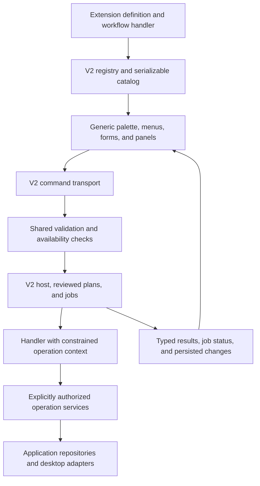
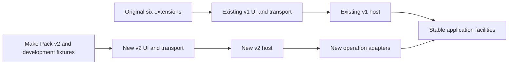

# Implement Foleyard extensions v2 from scratch

This is an implementation handoff. Work in `Daelars/foleyard-v2` and complete the system described below. Deliver working code, a rebuilt reference extension, application integration, tests, authoring tools, and current documentation. Do not stop after a plan, interfaces, mock UI, or a prototype.

## Outcome

Build a new extension system in which an author can add a supported workflow by supplying an extension package and one explicit registration entry. The package declares commands, settings, UI contributions, and workflow logic. The host supplies validation, authorized operations, execution tracking, persistence, and standard user interaction.

Rebuild **Make Pack** against this API as a usable reference extension. It must export real folder and ZIP packs through the new system. Keep the original six extensions working through v1.

The quality target is observable behavior, not a self-assigned score. A second, small fixture extension must reuse the API without adding extension-specific branches to the host, transport, or renderer.

## Scope and authorization

Implement the work locally through verification. Make ordinary design choices from the repository evidence and record them. Ask only when a missing product decision prevents safe progress. Do not ask for approval between routine implementation steps.

Do not publish a release, push commits, send messages, or create external issues as part of this task. Read relevant existing issues when useful. Do not alter user libraries to test the implementation. Use temporary files and disposable databases.

Read `AGENTS.md`, including more specific instructions in directories you change. Inspect the current working tree before editing. It may contain substantial staged and unstaged work. Preserve it; do not reset, overwrite, or move unrelated changes. Record your starting revision and baseline so existing failures are distinguishable from regressions.

Apply the available unslop skill to authored prose. Follow the repository's UI/component conventions and relevant skills. Use primary documentation when external technical facts need verification.

## What from scratch means

Create new v2 contracts, registry, execution host, service composition, transport, contribution renderer, and authoring examples. Do not subclass, wrap, delegate to, or rename the v1 extension host as v2. Do not implement a compatibility facade that runs v1 handlers and calls them v2 extensions.

The new host and reference extension must not import v1 extension contexts, registries, handlers, transport adapters, UI-intent dispatchers, or extension services. Do not copy the v1 extension engine into a new directory and retain its architecture.

Reuse stable non-extension facilities where appropriate: Yard Core domain records, Library repository contracts, database infrastructure, filesystem authorization, native picker/grant infrastructure, design-system components, and pure utilities. Reimplementing SQLite, filesystem grants, ZIP specifications, or the application's design system is not the objective.

Define the allowed dependency direction in an ADR and enforce it in CI. Keep framework and storage adapters outside the author-facing API. Extensions must not depend on React, Next routes, Electron, database handles, application internals, raw filesystem/process/network access, or privileged implementation modules.

Keep the six original packages under `packages/yard-tools/*`, their v1 contracts, routes, settings formats, and UI behavior unchanged. Additive application integration is expected. If a shared facility needs a behavioral change, isolate that change and test its existing callers. Never silently route v1 commands through v2.

Use a distinct reference identity such as `make-pack-v2`, displayed as **Make Pack v2**. It is a bundled internal example with an explicit enable/disable control, disabled by default. Enabling it exposes real product entry points. It does not replace the original Make Pack or migrate its settings automatically. Development fixtures are separate and must not enter production catalogs or packaged builds.

## Read the repository before designing

Start with these documents and follow their source maps:

- `docs/index.md`, `CONTEXT-MAP.md`, and `docs/agents/domain.md`.
- The context documents in `src`, `electron`, `packages/yard-core`, and `packages/yard-tools`.
- `docs/extensions.md`, `docs/architecture/extensions.md`, `docs/architecture/application.md`, and `docs/architecture/yard-core.md`.
- `docs/filesystem.md`, `docs/adr/filesystem-access.md`, and `docs/architecture/desktop.md`.
- `docs/library.md`, `docs/collections.md`, `docs/database.md`, `docs/commands.md`, `docs/events.md`, and `docs/settings.md`.
- `docs/runtime.md`, `docs/development.md`, `RELEASE.md`, and relevant existing ADRs.
- `docs/agents/issue-tracker.md` for tracker conventions.

Inspect the corresponding source. In particular, trace v1 registration, command transport, catalog projection, UI wiring, permissions, state, runtime introspection, documentation staging, and Make Pack's actual behavior. Inspect relevant tests and the current expected-failures ledger.

The earlier audit is background, not an implementation specification: `public/extension-system-proposal.html`. It recorded base commit `f7e7edd` with uncommitted changes. Its test counts and findings may have changed. This prompt supersedes its fixture-only stopping point: this task also delivers the rebuilt Make Pack example.

When source contradicts a guide, record the contradiction before relying on the guide. Do not infer an installed build's capabilities from the checkout version. If installed runtime information is unavailable, report it as unknown.

## Architecture to deliver

Choose clear module names and package boundaries after inspection. A reasonable shape is a framework-free v2 API within the Yard Core context, a separate host implementation, application-owned adapters, a generic renderer integration, and a new Make Pack v2 package. The exact directories are your decision; the dependency rules are requirements.

The intended call structure is:

Use one host execution path for HTTP and direct invocation. Renderer contributions never become permission enforcement. Registry entries and diagnostics never execute commands while describing them.

Preserve this separation during rollout:

## R1. Definitions, discovery, and compatibility

Provide typed extension definitions containing identity, package version, extension API version, requested permissions, commands, settings, contributions, documentation references, and lifecycle registration.

Use a single definition to derive runtime registration, catalog metadata, input validation, settings controls, and author documentation where practical. Avoid separate handwritten lists of command IDs or schemas that can drift.

Validate duplicate extension/command/contribution/setting IDs, namespace ownership, malformed defaults, unsupported API versions, unresolved command references, unknown permissions, and unsupported contribution types. Validate definitions at registration and external payloads at entry points. Reject incompatible definitions with actionable diagnostics.

Input and result schemas must be machine-readable and usable at runtime. Support the concrete types the reference and fixtures require. Do not build an entire schema language unnecessarily. Function handlers and validators stay out of serialized catalogs; serialization tests must actually detect unsupported values rather than rely on JSON silently dropping functions.

API v2 is internal and bundled-only for this release. Keep API version, extension version, product version, and runtime schema version separate. Document compatibility rules. No marketplace, external code loader, arbitrary remote code, or public stability promise is required.

## R2. Invocation and availability

Define canonical invocation and outcome contracts, with invocation IDs, extension/command ownership, validated input, selection snapshot, and typed failures. Support immediate values, reviewed interaction, and jobs without conflating them with subscription events.

Compute command availability from enabled state, input/selection requirements, runtime capabilities, granted permissions, and required context. Cover file, selection, folder, collection, global, and drop contexts where declared. Return a user-readable reason for unavailable commands. Required capabilities that are unknown do not count as available.

Use the same evaluator in the renderer and execution preflight. Recheck when execution actually starts. Validate untrusted selection IDs and scope at the host boundary, then resolve them through authorized Library operations. A file path supplied by a client is not authorization.

Choose and document v2 route names, status mappings, payload limits, and error envelopes. Keep v1 endpoints compatible. Resolve extension and command ownership before expensive hydration. Do not add command-name dispatch tables. If a resolver is needed, register it by a reusable input/context contract.

## R3. Permissions and operation services

Build explicit, deny-by-default operation permissions. Do not infer permissions from method names or grant every requested permission automatically. Effective permissions are the intersection of declarations and an explicit application policy or persisted approval. Use the same effective set in the context and catalog.

Implement services needed by Make Pack and the fixtures: paged Library reads and named selection sources, authorized file reads/copies/output creation, archive output, settings/state, and job reporting. Keep interfaces narrow and semantic. Do not expose a repository proxy, raw database, raw path resolver as the only protection, or an unrestricted filesystem API.

Enforce read permissions as well as mutations. Authorize the actual operation, including derived output and temporary paths. Readable Library roots and writable destination grants remain distinct. Deny missing, expired, foreign, or insufficient grants. Keep grant tokens and desktop secrets out of extension definitions, logs, exports, and persisted state.

Preserve canonical path, traversal, junction/symlink, existing-ancestor, and root protections in the filesystem ADR. Document validation-to-use race limits honestly. Output creation and cleanup must only affect resources the current job owns. Do not overwrite or delete unrelated files, even after an exception.

Enforce import/dependency restrictions for v2 packages, including forbidden transitive runtime dependencies. Test that the reference extension cannot import privileged application or v1 code. These build rules and guarded services support trusted bundled code; they do not constitute a sandbox against hostile JavaScript. Do not claim untrusted extension isolation. Any future isolation design needs its own ADR and tests.

## R4. Jobs, progress, cancellation, and failure

Implement a host-owned job lifecycle with identifiers, bounded concurrency, timestamps, progress, partial outcomes, cancellation, and bounded persisted history. Specify queued, running, cancellation-requested, succeeded, failed, cancelled, and interrupted states, or an equally precise state model. Represent partial work explicitly.

Choose one real status transport, such as polling or server-sent events, and implement reconnect/reload behavior. An ordinary HTTP request ending must not leave job ownership undefined. Extension code observes a cancellation signal; the host records when cancellation was requested and when work actually stopped.

Check cancellation between operations and during long streamed operations where supported. A timeout alone cannot forcibly stop arbitrary in-process JavaScript. State the limits. Never report a job as stopped while it continues writing files.

On restart, mark abandoned running jobs interrupted and expose their known outputs and recovery status. Do not replay filesystem effects automatically. Grants expire on restart. Persist enough ownership metadata for safe cleanup or review, without persisting grant tokens.

Define idempotency and retry rules. Duplicate requests must not start duplicate exports for the same invocation key. Never fall back to v1 after a v2 failure. A retry needs fresh authorization when required and must not overwrite completed outputs or pretend earlier effects were undone.

Disable rejects new work, requests cancellation of active jobs, and disposes services after their owned work finishes. Test concurrent invocation, disable, cancel, and reload behavior.

## R5. Preview, review, and apply

Provide a typed interaction model for input collection, preview, review, execution, and results. Standard forms, preview tables, confirmation, and result views must be generic renderer components.

Provide a host-validated prepare/review/apply contract for operations that require review. Bind a plan to its extension, command, validated targets/options, authorization context, expiry, and invocation. Revalidate changed targets and grants before apply. A client boolean such as `confirmed: true` is not sufficient. Expire or invalidate consumed plans according to documented retry rules.

Make Pack uses the preview/review flow to show source files, names, output format, destination, conflicts, missing sources, and manifest choice. Exercise destructive-plan behavior with a fixture over temporary or fake files. This task does not need to add a new destructive end-user extension.

Do not promise generic undo. Distinguish reversible application changes, cleanup of job-owned temporary output, and irreversible file effects.

## R6. All UI contribution points

Implement working adapters for the following contribution points. A manifest enum or catalog entry alone does not satisfy this requirement.

| Contribution point | Required behavior |
| --- | --- |
| Command palette | Generic command entries with availability reasons and invocation. |
| File/folder context menu | Context-aware items using validated selection/context and consistent ordering. |
| Selection actions | Actions for the current selection with empty/ineligible selection handling. |
| Toolbar | Declarative command placement without extension-specific callbacks. |
| Sidebar | Generic list panel with empty/loading/error states and item actions. |
| Settings | Validated controls, defaults, reset, enable/disable, and permission explanations. |
| Drop menu | A real application drop-menu adapter using validated drop context and capability checks. |
| Forms, previews, results | Generic field controls, validation errors, preview tables, reviewed actions, progress, and result details. |

Define stable contribution IDs, ordering rules, collision behavior, disposal, and selection/context updates. Extension definitions describe data; they do not inject arbitrary HTML, React, or executable renderer code. An escape hatch for trusted custom views can be documented as deferred, but standard contributions above must work.

Use Make Pack only where it makes product sense. Prove unused contribution points with development-only fixtures registered through the same production adapters. Do not force an export command into every menu merely to tick a box. A fixture-only imitation of a missing application adapter does not count.

Preserve accessibility, keyboard navigation, focus restoration, reduced motion, theme tokens, and usable narrow layouts. Keep existing v1 entries and shortcuts functioning. Extension disable/unregister must remove its UI and listeners. Do not leak duplicate registrations across development reloads.

## R7. Settings, state, and events

Provide extension-scoped settings and persistent state, with runtime validation, schema versions, reset semantics, transactional migrations, and safe failure behavior. The host supplies the namespace; extension code cannot select another extension's namespace.

Separate author-declared settings from workflow state and host-owned job records. Keep bounded history and define retention. Validate writes and loaded persisted data. A failed migration must preserve usable prior data or disable that extension with an actionable diagnosis.

Persist changes before notifying consumers. Implement only the typed event contracts needed by settings, state, jobs, and contribution refresh. Define payloads, ownership, subscription disposal, and recovery through rereads. Do not represent high-frequency renderer state as persisted extension events.

Keep v1 storage unchanged. Make Pack v2 starts with its own settings namespace. Offer a documented explicit import only if needed; do not silently copy or rewrite v1 state. Any future replacement of v1 needs a separate compatibility and rollback plan.

## R8. Rebuild Make Pack as the reference extension

Read the existing manifest, command definitions, settings, service, ZIP writer, app dialogs, source stores, and tests. Preserve useful product behavior and deliberately fix problems in the new implementation. Do not preserve a known data-loss defect for parity.

Deliver these workflows through the new API:

- Pack from selected files.
- Pack from current Sound Shelf items.
- Pack from recently previewed sounds, following the current persisted source semantics.
- Folder and ZIP output.
- Pack name, default output format, and include-manifest settings.
- Input validation, preview, destination selection, confirmation, job progress, cancellation, and detailed results.
- Missing/removed sources, deduplication, filename sanitization, output-name collisions, existing destination conflicts, and partial failures.

Supply Shelf/recent data through application-owned named source adapters. These adapters may read existing persisted application records through appropriate storage contracts. They must not execute v1 extension commands or call v1 transport. If a source depends on runtime availability, report that dependency instead of silently returning an empty selection.

The new package owns export workflow policy, command declarations, settings, contribution data, and schema-backed results. It uses v2 services for every privileged effect. Archive encoding and output I/O belong behind the authorized application service; do not import the v1 ZIP service into the extension.

Stream large files and archive output with bounded memory. Define supported archive limits and reject unsupported sizes before producing a misleading success. Reserve output names safely, including `manifest.json`, case-insensitive collisions, and names invalid on supported operating systems. Never overwrite an audio source or an existing manifest sidecar. Use unique job-owned temporary resources and cleanup by ownership, not guessed filenames.

Verify ZIP integrity and contents with an independent reader or extraction step. Confirm file bytes, entry names, manifest behavior, counts, and missing-file reporting. Define whether cancellation preserves partial output or removes job-owned incomplete output; implement and document that policy. Never delete unrelated destination contents.

Show a useful result with output location, copied/skipped/failed counts, individual reasons, and a capability-aware reveal/open action. Make Pack v2 must be usable from the real application when enabled, not only from tests or a prototype page.

Add a before/after parity table covering all original workflows, intentional improvements, and any explicit unsupported behavior. The three source workflows and both output formats above are mandatory.

## R9. Authoring and diagnostics

Provide a repository command that scaffolds a valid minimal v2 extension package, tests, and README. Its output must typecheck and run. Use explicit static registration for bundled packages; an installer is not required.

Provide a development fixture page or workbench to preview contributions, inspect sanitized catalog definitions, invoke commands against a disposable Library, and inspect job outcomes. Use the repository's development reload mechanism or implement an explicit reload action. Test disposal and prevent duplicate handlers or contributions.

Provide an execution inspector with invocation/job IDs, state transitions, availability reasons, denied permission names, and sanitized error details. Local detailed views may show information needed to diagnose the user's own operation; exported runtime diagnostics must follow the existing privacy rules. Redact paths, settings values, tokens, secrets, and raw stack traces where required. Bound log/history storage.

Add at least two small fixtures beyond Make Pack: one that exercises otherwise-unused contribution/context types, and one that tests jobs, permissions, or isolated state. These are conformance examples, not additional production extensions. Demonstrate that registering them requires no fixture-ID branches in production code.

## R10. Update every affected repository contract

Maintain a traceability checklist mapping these requirements to implementation, tests, and documentation. Check each area below. Update it when behavior changes; otherwise record why no change is needed. Do not mechanically edit unrelated subsystems.

| Area | Required coverage |
| --- | --- |
| Domain and architecture | Context ownership, dependency rules, new terminology, coexistence ADR, permission/trust ADR, job/recovery and state-version decisions. |
| API packages | Exports, package metadata, workspace resolution, browser/server separation, schemas, dependency enforcement. |
| Application/HTTP | V2 routes, transport errors, client invocation, input limits, catalog and availability. |
| UI | Every contribution adapter, settings, enablement, forms, preview, jobs, results, accessibility and theme behavior. |
| Database | Real migrations for state/jobs if used, transactions, initialization, retention, restart and migration failures. |
| Filesystem | Grants, ownership, safe output, cleanup, streaming, archive limits, cancellation and conflicts. |
| Desktop/IPC | Reuse or extend native pickers/reveal capabilities with channel/handler/preload/client/test parity. Change only what v2 needs. |
| Runtime discovery | V1/v2 identity, actual registration and enablement, API standing, capabilities, contributions, commands, events, settings schema references, and limitations. |
| Documentation delivery | Registry entries, docs IDs, version-matched staging, packaged resources, docs endpoints, executable-example metadata, missing-document behavior. |
| Authoring | Scaffold command, runnable examples, workbench, troubleshooting, conformance tests and development reload. |
| Build and CI | Package inclusion, dependency checks, test commands, lint/typecheck, docs checks, production fixture exclusion and non-publishing package verification. |
| Release and migration | Release notes, internal/experimental status, enable/disable steps, v1 preservation, future cutover and rollback conditions. |

Update `docs/index.md` and relevant current guides, including extensions, architecture, commands, events, settings, runtime, filesystem, database, development, and quickstart. Add a dedicated v2 authoring/API guide, migration guide, Make Pack example walkthrough, and troubleshooting guide. Update the root/package READMEs and `RELEASE.md` where applicable.

Register new current docs in the real documentation manifest and verify staged reads. Do not treat writing Markdown files as completion of installed documentation. Check documentation schema/version behavior and runtime export consumers. Do not describe a capability as available merely because it is declared. Introspection must not execute handlers or cause unintended database initialization/migration.

Include diagrams for v1 versus v2 execution, module dependencies, UI contribution resolution, job state transitions, and coexistence/future migration. Keep diagrams consistent with implemented code. Update `public/extension-system-proposal.html` or create a linked implementation companion with embedded diagrams that work offline. Distinguish implementation status from remaining proposals. Do not register this handoff prompt or historical audits as shipped product documentation.

Document concrete author examples for adding a command, standard form, sidebar list, setting, guarded operation, job, event subscription, and migration. Each runnable example needs prerequisites, exact commands, expected output, and API/version provenance. Verify commands, links, and source maps.

## R11. Verification

Establish the baseline before edits. Use fixture-first tests to specify v2 behavior, then exercise real adapters and the reference extension. Tests must assert observable behavior, not just mirror object construction.

Required evidence includes:

- Registration validation, ownership, API compatibility, input/result schemas, and truly serializable catalogs.
- An unauthorized handler that omits its own permission check still cannot read/write through v2 services.
- Direct-host and HTTP behavior agree; unknown capabilities and invalid contexts fail predictably.
- Grant expiry, traversal/junction escapes, output conflicts, and job-owned cleanup preserve unrelated files.
- More than 5,000 Library records are processed through bounded iteration or explicitly reported incomplete.
- Job cancellation, partial failure, duplicate invocation, concurrency limits, disable/disposal, reconnect, and restart interruption.
- Two extensions cannot access each other's state. Failed state migrations preserve prior data.
- Reviewed plans reject altered/expired/replayed requests according to their documented policy.
- Real Make Pack folder and ZIP exports for selection, Shelf, and recent sources. Include manifest on/off, colliding names, missing files, output conflicts, interrupted output, and the existing sidecar data-loss class.
- Every UI contribution adapter receives an interaction test, including context changes and disable cleanup. Verify actual application integration, not only a fixture page.
- Keyboard/focus behavior, disabled reasons, validation errors, progress, result rendering, theme and narrow layouts. Inspect rendered UI and record what was checked.
- Scaffolded output and runnable examples work; development reload cleans up; production builds exclude test fixtures/workbench access.
- Runtime introspection remains read-only, reports real availability and v1/v2 identity, and exports no sensitive payloads.
- Version-matched docs stage and read correctly, and builds contain required v2 code/resources.
- Original six extensions retain their previous behavior. Existing expected failures remain tracked unless their actual v1 defect was separately fixed.

Run focused tests during development, then the repository's required lint, typecheck, full tests, coverage checks, docs checks, and production build. Inspect current scripts before invoking them. Do not lower thresholds, mark new failures expected, or delete failing tests to obtain a pass.

Verify a non-publishing desktop package when the environment supports it. Use an isolated test profile and disposable Library; avoid scripts that reset user data. Native build scripts can change local binary ABI, so preserve or restore the development environment through the repository's supported workflow. Never run publishing commands.

If an environment dependency prevents a check, capture the exact failure, distinguish it from a code failure, and finish all independent work. Do not claim the check passed or that a packaged installation was verified when it was not.

## Delivery order

1. Inspect the repository and baseline. Write the short architecture decisions and requirement-to-test checklist.
2. Build the independent API, registry, host, preflight, and permission services. Prove them with fixtures.
3. Complete real adapters, jobs, state, interaction contracts, and all contribution adapters. Keep v1 unchanged.
4. Build Make Pack v2 from scratch using those contracts. If it exposes an API gap, solve the general requirement rather than adding a Make Pack branch to the engine.
5. Finish authoring tooling, diagnostics, runtime discovery, docs staging, diagrams, CI/build integration, and verification.
6. Review the completed change against every requirement. Resolve missing integration before handing back.

Maintain a concise local implementation log with decisions, completed requirements, test evidence, and remaining work so another agent can resume if context is compacted. Keep implementing across milestones; producing the log or plan is not the deliverable.

## Definition of done

The task is complete only when all of the following hold:

- V2 executes through its own engine and has enforced dependency rules separating it from v1.
- All required contribution points work through generic application adapters.
- Make Pack v2 is a real, opt-in application extension covering all three sources and both output formats.
- Standard extensions require only package implementation and explicit registration, with no per-extension transport/renderer/host branches.
- Permissions, grants, jobs, state, reviewed actions, and recovery have behavioral tests over realistic failures.
- Original extensions, their data, and unrelated working-tree changes remain intact.
- Authoring tools, examples, runtime discovery, docs, diagrams, build, and CI integration are complete.
- Required checks pass, or genuine external blockers are precisely reported without a false completeness claim.

In the final handoff, provide the implemented architecture and paths, how to enable and use Make Pack v2, how to scaffold another extension, verification results, documentation/diagram links, and remaining limitations. State exactly what remained on v1. Do not present this work as an externally sandboxed extension ecosystem or claim a numerical quality score.
